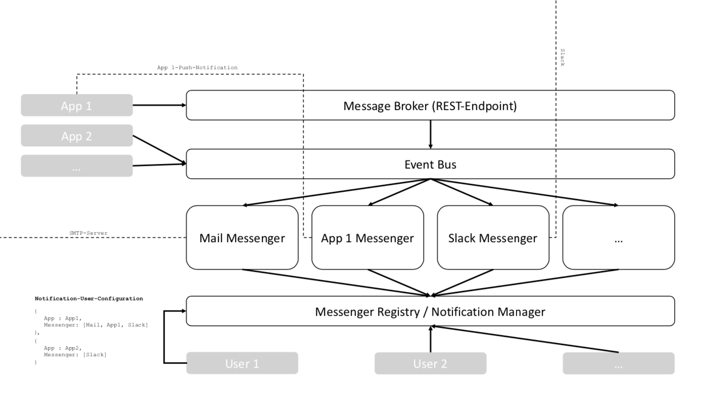

# reactive-message-distribution
This project is a POC of a central messaging system.
Each messenger should be an independent service represented as a vert.x verticle.
The messengers register themselves at a messenger registry.
Users can configure which messenger should deliver messages application dependent.
## Overview


## Model of our Message
```typescript
{
  senderApplication: string,
  receiverIdentifier: string[],
  message: {
    textMessage: string,
    htmlMessage?: string
  },
  timestamp: Date
}
```
## Getting Startet
### Environment Variables
To use the Mail Messenger you have to set following environment variables:
- `SMTP-SERVER-HOST`
- `SMTP-SERVER-PORT`
- `SMTP-SERVER-USER`
- `SMTP-SERVER-PASS`

### Run the demo application
1. Go to `./reactive-message-distribution`
1. execute `sbt run`

### Scope of this demo application
This demo app implements two messengers:
- Mail Messenger (with implemented SMTP interface)
- Telegram Messenger (without an implemented telegram interface yet)

It also implements an example of a messenger registry.

Each messenger subscribes the `avengers.helicarrier.communication` channel and redirect the messages appearing on this channel. Furthermore they register themselves at the messenger registry.

The demo package deploys the messengers and the registry as vert.x verticles and publish some demo-messages to the `avengers.helicarrier.communication` channel.

### Missing
- REST Endpoint for applications which can not publish messages directly to the EventBus.
- Receiver Resoultion for each Messenger: Translate the `receiverIdentifier` to the messenger specific receiver (e.g. translage `receiverIdentifier` to mail-address)
- Implementation of the `message-model` (messages are raw strings at this moment)
- Frontend stuff
